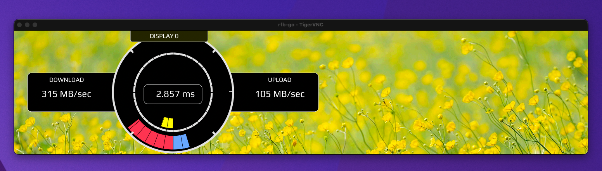
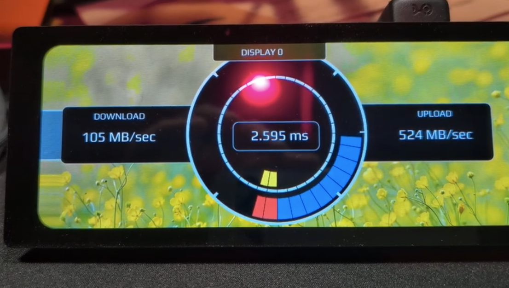

# go-gui

Toolkit for making raw UI Stuff in golang for use with RPIs and touch displays.

# Building

You can build the examples by running:

```aiignore
roland@rpi go-gui % make
go build -o build/demo github.com/thirdmartini/gogui/cmd/demo
```

# Running

If you copy the demo binary someplace else make sure you copy the assets folder as well.

## VNC Mode

The demo comes with very basic VNC server, but its functional enough to run the demo and test the UI without running 
on an RPI.



```aiignore
roland@rpi go-gui % ./build/demo -vnc

2026/06/18 22:12:11 Listening on: vnc://localhost:9000
...
```
I've tested this with TigerVNC on macOS.  It does NOT work with the builtin VNC viewer on the mac as the server does 
not support authentication required by the MacOS Builting VNC viewer.  Use TigerVNC from brew (or add the missing vnc features.)

## Real Mode

Note that the demo app is configured for the [WaveShare 11.9" touch display](https://www.amazon.com/dp/B092LSDMP8) 
which has a resolution of 320x1480.  The demo is running it as a 1480x320 by setting rotation to 90degrees in the 
demo code. 

```aiignore
roland@rpi go-gui % sudo ./build/demo
 
Frame buffer opened
Frame buffer mmap
Frame setfd
FB Acquired
...
```

Short Video:

[](https://www.youtube.com/watch?v=aj_DWQwIO-I)


